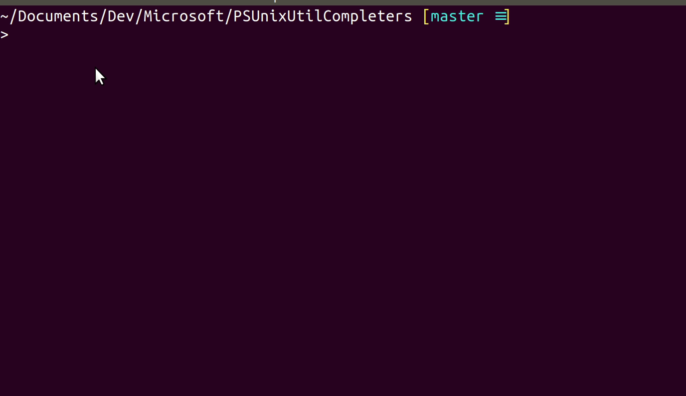

# Microsoft.PowerShell.UnixCompleters

PowerShell parameter completers for native commands on Linux and macOS.

This module uses completers supplied in traditional Unix shells
to complete native utility parameters in PowerShell.



Currently, this module supports completions from zsh and bash.
By default it will look for zsh and then bash to run completions
(since zsh's completions seem to be generally better).

## Basic usage

To enable unix utility completions,
install this module and add the following to your profile:

```powershell
Import-Module Microsoft.PowerShell.UnixCompleters
```

There is also an alternate command, `Import-UnixCompleters`,
that has the same functionality but is discoverable by command completion.

This will register argument completers for all native commands
found in the usual Unix util directories.

Given the nature of native completion results,
you may find this works best with PSReadLine's MenuComplete mode:

```powershell
Import-Module Microsoft.PowerShell.UnixCompleters

Set-PSReadLineKeyHandler -Key Tab -Function MenuComplete
```

## Further configuration

If you wish to set a preferred shell, you can do so by setting an environment variable:

```powershell
$env:COMPLETION_SHELL_PREFERENCE = 'bash'

# OR

$env:COMPLETION_SHELL_PREFERENCE = '/bin/bash'

Import-Module Microsoft.PowerShell.UnixCompleters
```

Note that you must do this before you load the module,
and that setting it after loading will have no effect.

If you want to change the completer after loading,
you can do so from PowerShell like so:

```powershell
Set-UnixCompleter -ShellType Zsh

# Or if you have a shell installed to a particular path
Set-UnixCompleter -Shell "/bin/zsh"

# You can even write your own utility completer by implementing `IUnixUtilCompleter`
$myCompleter = [MyCompleter]::new()
Set-UnixCompleter -Completer $myCompleter
```

## Unregistering UNIX util completions

The Microsoft.PowerShell.UnixCompleters module will unregister completers
for all the commands it registered completers for
when removed:

```powershell
Remove-Module Microsoft.PowerShell.UnixCompleters
```

As with loading, there is also a convenience command provided for this:

```powershell
Remove-UnixCompleters
```

## Building the module yourself

Microsoft.PowerShell.UnixCompleters comes with a PowerShell build script,
which you can invoke to build the module yourself with:

```powershell
./build.ps1 -Clean
```

This will output the built module to `out/Microsoft.PowerShell.UnixCompleters`.

## Credits

All the zsh completions provided by this module are made possible
by the work of [@Valodim](https://github.com/Valodim)'s zsh completion project,
[zsh-capture-completion](https://github.com/Valodim/zsh-capture-completion),
which this module invokes to get completion results.

The bash completions provided by this module are adapted from the work
done by [@mikebattista](https://github.com/mikebattista) for his
[PowerShell-WSL-interop](https://github.com/mikebattista/PowerShell-WSL-Interop) PowerShell module.
